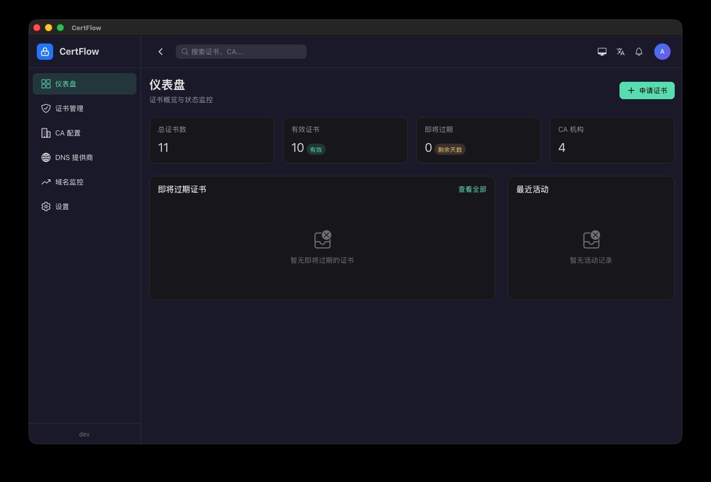
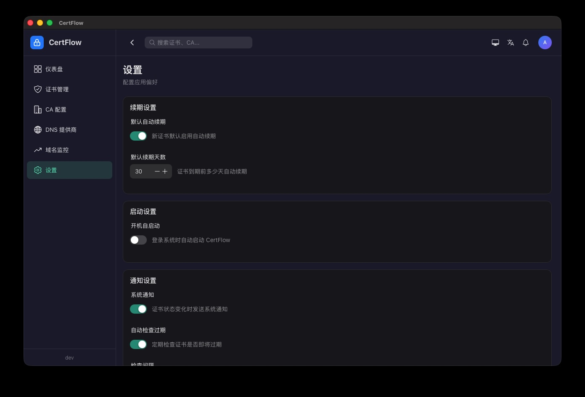
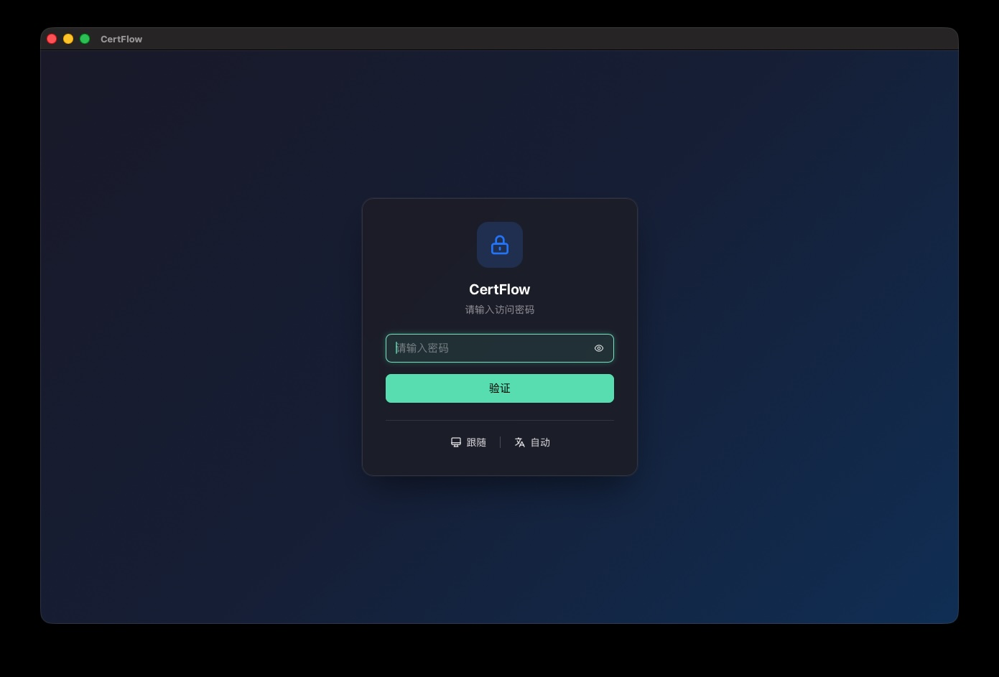
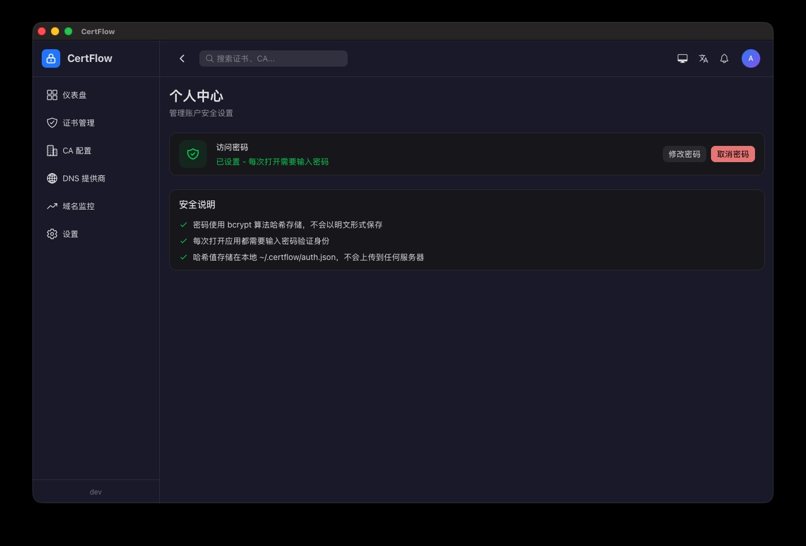

# CertFlow

[English](README_EN.md) | 中文

SSL 证书管理工具，支持证书申请、续期、过期监控等功能。

采用 Go + Vue 3 跨平台桌面应用架构，基于 Wails v3 框架。

## 功能特性

- **证书管理** — 申请、续期、撤销、上传 SSL 证书，支持 30+ DNS 提供商自动验证
- **证书部署** — 一键将证书部署到云厂商 CDN / WAF / 负载均衡 / 边缘加速等，支持阿里云、腾讯云、华为云、百度云、天翼云、火山引擎
- **域名监控** — HTTPS/HTTP 健康检查，证书过期预警
- **自动续期** — 定时任务自动续期即将过期的证书
- **证书扫描** — 扫描并归集证书，统一查看有效期与到期预警
- **账户与安全** — 登录认证、TOTP 双因素（2FA）、Passkey / 生物识别（Touch ID、Windows Hello）
- **应用内更新** — 启动后自动检查并安装新版本（基于 GitHub Release 校验和）
- **系统托盘** — 后台常驻，菜单快速操作（检查更新、申请证书、退出）
- **多平台** — 支持 macOS、Windows、Linux

## 截图

<div align="center">
  
  <br>
  
  <br>
  
  <br>
  
</div>

## 快速开始

```bash
# 安装依赖
make deps

# 启动开发模式
make dev

# 构建生产包（带版本号）
make build VERSION=1.0.0

# 打包 macOS 应用
make package VERSION=1.0.0
```

## 开发命令

```bash
make help              # 查看所有命令
make lint-go           # Go 代码检查（golangci-lint）
make lint-go-fix       # Go 代码检查（自动修复）
make check             # 代码检查与测试（golangci-lint + 前端类型检查 + 单测）
make test              # Go 后端测试
make bindings          # 生成 Wails TypeScript 绑定
make ent               # 生成 Ent ORM 代码
make format            # 格式化所有代码（Go + Vue/TS）
make format-go         # 格式化 Go 代码
make format-frontend   # 格式化前端代码
```

## 技术栈

- **后端**：Go 1.26 + Wails v3 + Ent ORM + lego v5（ACME）+ SQLite；认证使用 go-webauthn + pquerna/otp（2FA）；证书部署对接阿里云 / 腾讯云 / 华为云 / 百度云 / 天翼云 / 火山引擎云 SDK
- **前端**：Vue 3 + TypeScript + Vite 8 + Tailwind CSS v4 + Naive UI v2 + Pinia

## 仓库

| 平台 | 地址 |
|------|------|
| CNB | https://cnb.cool/dtapp/certflow |
| GitHub | https://github.com/dtapps/certflow |
| Gitea | https://gitea.com/dtapps/certflow |
| GitLab | https://gitlab.com/dtapps/certflow |
| Gitee | https://gitee.com/dtapps/certflow |
| GitCode | https://gitcode.com/dtapp/certflow |

## 发布

- **正式发布**：在 GitHub Actions 的 Release 工作流中手动输入版本号，六个平台并行构建并发布 GitHub Release
- **每日构建（Nightly）**：GitHub Actions 每日 UTC 00:00 自动构建 `X.Y.Z-nightly` 预发布版本
- 构建产物也从 GitHub Release 下载，供 CNB 等平台发布

## 开发文档

详见 [DEVELOPMENT.md](DEVELOPMENT.md)
