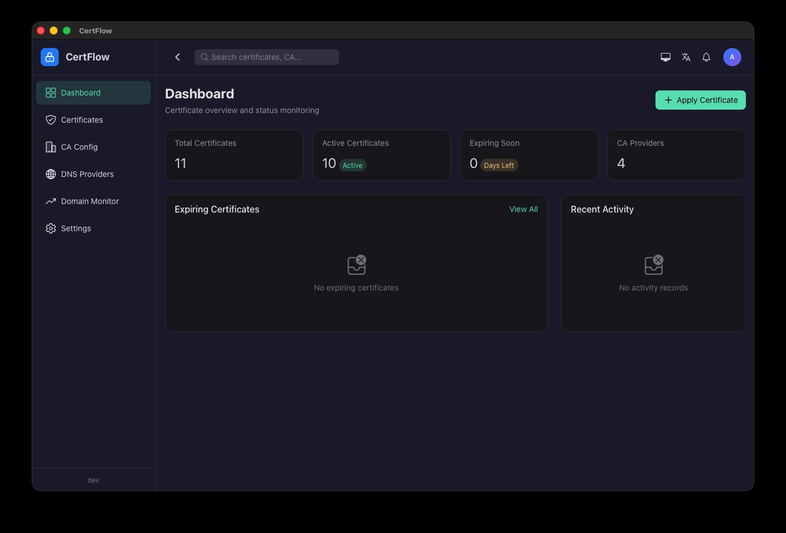
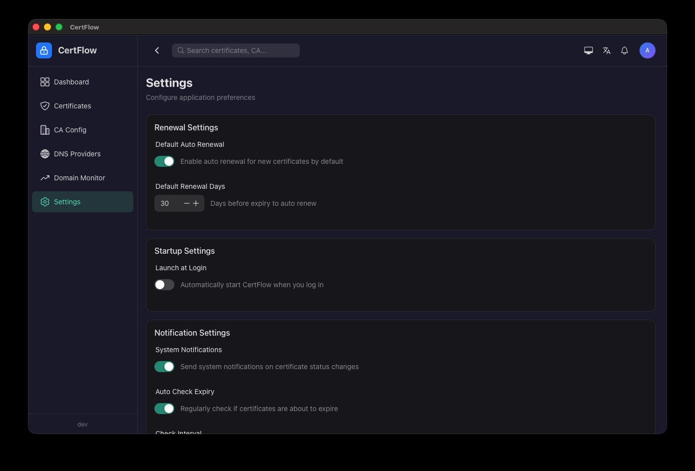
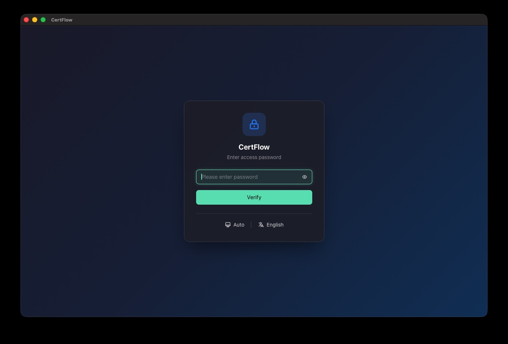
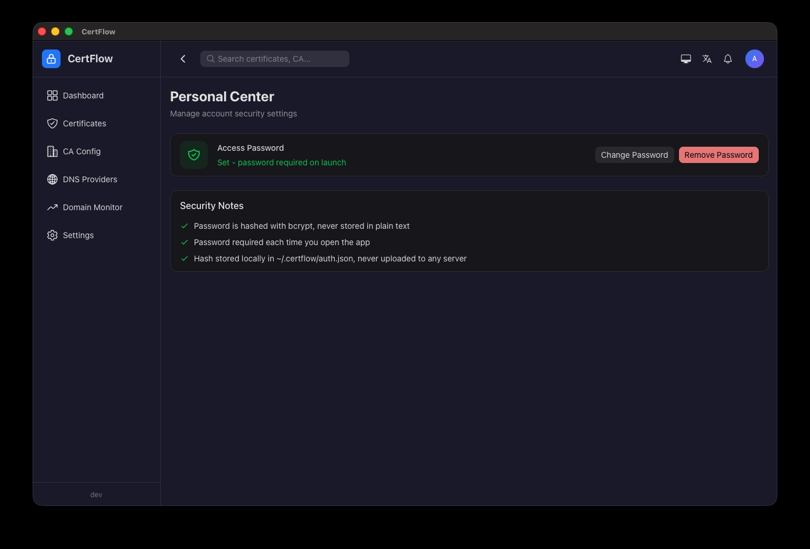

# CertFlow

English | [中文](README.md)

SSL certificate management tool with support for certificate issuance, renewal, and expiration monitoring.

Built with Go + Vue 3 cross-platform desktop application architecture, powered by Wails v3.

## Features

- **Certificate Management** — Issue, renew, revoke, and upload SSL certificates with 30+ DNS provider auto-verification
- **Certificate Deployment** — One-click deploy certificates to cloud CDN / WAF / load balancer / edge acceleration, supporting Alibaba Cloud, Tencent Cloud, Huawei Cloud, Baidu Cloud, CTYun, and Volcengine
- **Domain Monitoring** — HTTPS/HTTP health checks and certificate expiration alerts
- **Auto Renewal** — Scheduled tasks to automatically renew expiring certificates
- **Certificate Scanning** — Scan and aggregate certificates, view validity and expiration warnings in one place
- **Account & Security** — Login authentication, TOTP two-factor (2FA), Passkey / biometrics (Touch ID, Windows Hello)
- **In-App Updates** — Automatically check for and install new versions on launch (via GitHub Release checksums)
- **System Tray** — Runs in the background with a menu for quick actions (check update, apply cert, quit)
- **Multi-Platform** — Supports macOS, Windows, and Linux

## Screenshots

<div align="center">
  
  <br>
  
  <br>
  
  <br>
  
</div>

## Quick Start

```bash
# Install dependencies
make deps

# Start development mode
make dev

# Build production package (with version)
make build VERSION=1.0.0

# Package macOS application
make package VERSION=1.0.0
```

## Development Commands

```bash
make help              # View all commands
make lint-go           # Go code linting (golangci-lint)
make lint-go-fix       # Go code linting (auto-fix)
make check             # Lint and test (golangci-lint + frontend type check + unit tests)
make test              # Go backend tests
make bindings          # Generate Wails TypeScript bindings
make ent               # Generate Ent ORM code
make format            # Format all code (Go + Vue/TS)
make format-go         # Format Go code
make format-frontend   # Format frontend code
```

## Tech Stack

- **Backend**: Go 1.26 + Wails v3 + Ent ORM + lego v5 (ACME) + SQLite; auth uses go-webauthn + pquerna/otp (2FA); certificate deployment integrates Alibaba Cloud / Tencent Cloud / Huawei Cloud / Baidu Cloud / CTYun / Volcengine SDKs
- **Frontend**: Vue 3 + TypeScript + Vite 8 + Tailwind CSS v4 + Naive UI v2 + Pinia

## Repositories

| Platform | URL |
|----------|-----|
| CNB | https://cnb.cool/dtapp/certflow |
| GitHub | https://github.com/dtapps/certflow |
| Gitea | https://gitea.com/dtapps/certflow |
| GitLab | https://gitlab.com/dtapps/certflow |
| Gitee | https://gitee.com/dtapps/certflow |
| GitCode | https://gitcode.com/dtapp/certflow |

## Release

- **Stable Release**: Trigger the GitHub Actions Release workflow manually with a version number; six platforms build in parallel and publish a GitHub Release
- **Nightly Build**: GitHub Actions automatically builds a `X.Y.Z-nightly` pre-release every day at UTC 00:00
- Build artifacts are also downloaded from GitHub Release for publishing on platforms like CNB

## Development Documentation

See [DEVELOPMENT_EN.md](DEVELOPMENT_EN.md)
